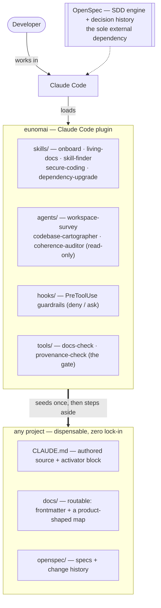

# eunomai

> A focused, **Claude-only AI workspace** — *good order* for AI-assisted development, packaged as a Claude Code
> plugin. **OpenSpec** is the only external dependency.

**At a glance.** eunomai is a one-shot **connector**: it seeds a project with four pillars — spec-driven change
(SDD), living docs, safe controls, and trust-gated skills — then steps aside. Everything it seeds lives in the
project's own files (**zero lock-in**); the knowledge is plain, AI-routable Markdown. It's for developers who
want a project that's **understandable at a glance — to a newcomer and to an agent alike**. The name comes from
**Eunomia** (Εὐνομία), the Greek personification of *good order*.

## Architecture at a glance



## Quickstart

```text
npm i -g @fission-ai/openspec        # the SDD engine (reused, installed separately)
/plugin marketplace add grojof/eunomai
/plugin install eunomai@eunomai
/reload-plugins
/eunomai:eunomai-onboard             # apply eunomai to a new or existing project
```

Full walkthrough → **[Getting started](docs/guides/getting-started.md)**.

## The surface

**New here**
- **[Getting started](docs/guides/getting-started.md)** — install + apply eunomai to a project + the daily loop.

**How-to**
- **[Manage skills](docs/guides/manage-skills.md)** — add or audit a skill behind the trust gate.
- **[Refresh living docs](docs/guides/refresh-living-docs.md)** — keep docs fresh and structurally honest.
- **[Run the checks](docs/guides/run-the-checks.md)** — the read-only gate (`docs-check`, `provenance-check`).
- **[Contributing](docs/guides/contributing.md)** — the dev loop for working **on** eunomai.

**The pillars** (reference)
- **[SDD](docs/reference/sdd.md)** — the spec-driven flow on OpenSpec (explore → propose → apply → archive).
- **[Living docs](docs/reference/living-docs.md)** — the v2 docs standard (Diátaxis-as-lens + OKF-routable).
- **[Safe controls](docs/reference/safe-controls.md)** — the `PreToolUse` hooks + the permissions baseline.
- **[Skill finder](docs/reference/skill-finder.md)** — the skill trust gate, provenance + `provenance-check`.
- **[Base skills](docs/reference/base-skills.md)** — the standards-anchored base set + the admission filter.
- **[Onboard](docs/reference/onboard.md)** — the connector/bootstrap that applies eunomai to a project.
- **[Checks](docs/reference/checks.md)** — the read-only checks CLI (`docs-check`, `provenance-check`).

**Go deeper** (explanation)
- **[Vision / Charter](docs/explanation/vision.md)** — what eunomai is, its principles, pillars, architecture.
- **[Knowledge-driven development](docs/explanation/knowledge-driven-development.md)** — the KDD lens:
  eunomai as a knowledge-activation spectrum (passive docs → active skills/hooks).

**Decisions** → **[docs/decisions/](docs/decisions/)** — the ADR series (OpenSpec · KDD · OKF · Claude-only ·
living-docs v2).

## One principle above all

**Don't reinvent — stand on the best existing tools and build only the tailored glue.**
