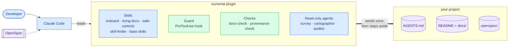
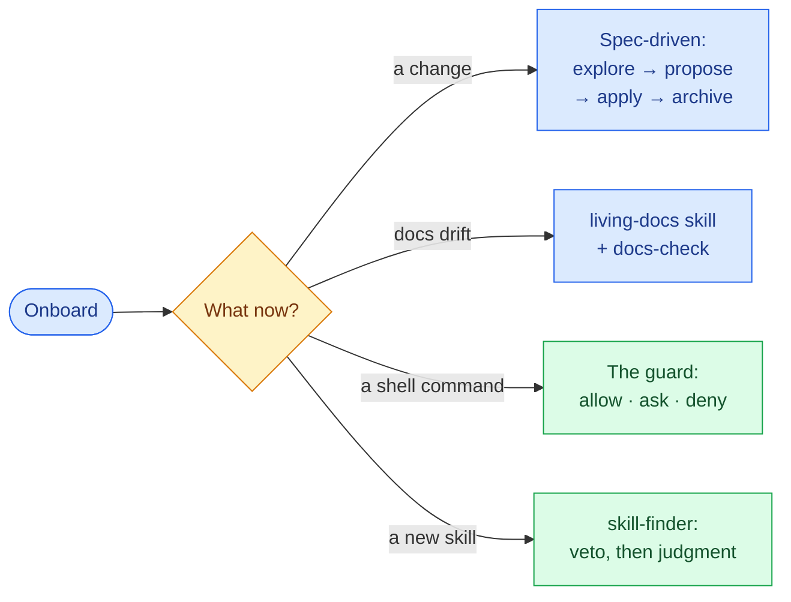

# eunomai

> *Good order* for AI-assisted development: a **Claude Code plugin** that gives a project spec-driven change,
> living docs, safe controls and trust-gated skills, then steps aside.

eunomai is a one-shot **connector**. It seeds a project with conventions, a docs standard, a safety guard and a
skills gate, and everything it seeds lives in the project's own files, so there is **zero lock-in**. It stands
on Claude Code's own primitives and on **OpenSpec**, its only external dependency, and builds only the glue. It
is for developers who want a project that reads clearly at a glance, to a newcomer and to an agent alike. The
name comes from **Eunomia** (Εὐνομία), the Greek personification of *good order*.

## What it gives a project

| Pillar | What it does |
|---|---|
| **Spec-driven change** | Non-trivial changes go explore → propose → apply → archive on OpenSpec, with a thin eunomai layer that feeds the project's conventions into every artifact. |
| **Living docs** | A light standard: frontmatter on every page, the README as a map every page is reachable from, one fact in one home. `docs-check` enforces the shape; a skill keeps the docs fresh. |
| **Safe controls** | A `PreToolUse` guard that reads shell commands as commands. Quiet on routine work; asks before what cannot be undone; refuses an AI co-author line. Tunable per user and per repo. |
| **Trust-gated skills** | A security veto, then judgment, before a third-party skill is adopted, with its provenance recorded and `provenance-check` in the gate. |
| **Onboard** | Applies all of it to a new or existing project, respecting what is already there: it adapts, never replaces. |

## How it works


```mermaid
flowchart LR
    Dev([Developer]) --> CC[Claude Code]
    OS[[OpenSpec]] -.-> CC
    CC -->|loads| Plugin
    subgraph Plugin["eunomai plugin"]
        direction TB
        Skills[Skills<br/>onboard · living-docs · safe-controls<br/>skill-finder · base skills]
        Guard[Guard<br/>PreToolUse hook]
        Checks[Checks<br/>docs-check · provenance-check]
        Agents[Read-only agents<br/>survey · cartographer · auditor]
    end
    Plugin ==>|seeds once,<br/>then steps aside| Project
    subgraph Project["your project"]
        direction TB
        AG[(AGENTS.md)]
        DOCS[(README + docs/)]
        SPECS[(openspec/)]
    end
    classDef step fill:#dbeafe,stroke:#2563eb,color:#1e3a8a
    classDef guard fill:#dcfce7,stroke:#16a34a,color:#14532d
    classDef data fill:#ede9fe,stroke:#7c3aed,color:#4c1d95
    class Dev,CC,Skills,Agents step
    class Guard,Checks guard
    class OS,AG,DOCS,SPECS data
```

Once onboarded, each pillar takes over its part of the daily work:


```mermaid
flowchart LR
    O([Onboard]) --> L{What now?}
    L -- a change --> S[Spec-driven:<br/>explore → propose<br/>→ apply → archive]
    L -- docs drift --> D[living-docs skill<br/>+ docs-check]
    L -- a shell command --> G[The guard:<br/>allow · ask · deny]
    L -- a new skill --> K[skill-finder:<br/>veto, then judgment]
    classDef step fill:#dbeafe,stroke:#2563eb,color:#1e3a8a
    classDef ask fill:#fef3c7,stroke:#d97706,color:#78350f
    classDef guard fill:#dcfce7,stroke:#16a34a,color:#14532d
    class O,S,D step
    class L ask
    class G,K guard
```

## Quickstart

```text
npm i -g @fission-ai/openspec        # the SDD engine, installed separately
/plugin marketplace add grojof/eunomai
/plugin install eunomai@eunomai
/reload-plugins
/eunomai:eunomai-onboard             # apply eunomai to a new or existing project
```

To update later: `claude plugin marketplace update eunomai`, then `claude plugin update eunomai@eunomai`
(or `/plugin`). The full walkthrough is in **[Getting started](docs/getting-started.md)**.

## Documentation

| I want to… | Read |
|---|---|
| Install eunomai and apply it to a project | [Getting started](docs/getting-started.md) · [Onboard](docs/onboard.md) |
| Make a change the spec-driven way | [SDD](docs/sdd.md) |
| Keep docs fresh, or know the docs standard | [Refresh living docs](docs/refresh-living-docs.md) · [Living docs](docs/living-docs.md) |
| Understand, tune or relax the guard, and set the AI-attribution policy | [Safe controls](docs/safe-controls.md) |
| Add or audit a skill safely | [Manage skills](docs/manage-skills.md) · [Skill finder](docs/skill-finder.md) · [Base skills](docs/base-skills.md) |
| Run the checks locally or in CI | [Checks](docs/checks.md) |
| Roll eunomai out in an organization, or remove it | [Adopt in an organization](docs/org-adoption.md) |
| Know why eunomai is shaped this way | [Vision](docs/vision.md) · [Knowledge-driven development](docs/knowledge-driven-development.md) · [Decisions](docs/decisions/) |
| Contribute, or cut a release | [CONTRIBUTING](CONTRIBUTING.md) · [AGENTS.md](AGENTS.md) · [CHANGELOG](CHANGELOG.md) · [SECURITY](SECURITY.md) |

## Principles

- **Don't reinvent.** Stand on Claude Code and OpenSpec; build only the tailored glue.
- **Seed and step aside.** Everything lives in the project's files; eunomai is dispensable.
- **Coexist.** Add to what a project or organization already has; on conflict the incumbent wins.
- **The human decides.** Skills suggest, the guard asks, and nothing is rewritten silently.
- **Low maintenance over reach.** Small gates, criteria over curated lists, one fact in one home.

More in the [Vision](docs/vision.md). Licensed under [MIT](LICENSE).
