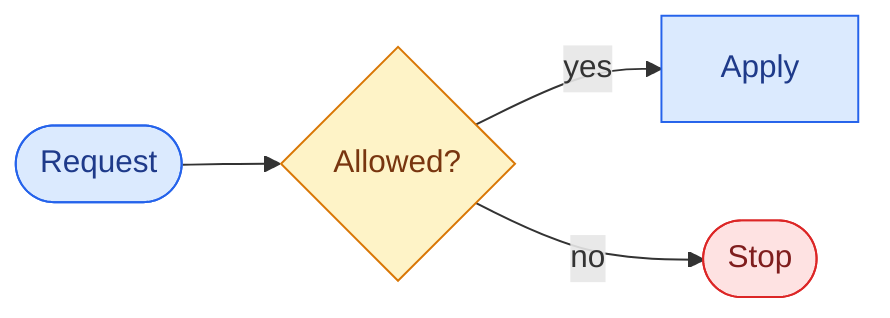

# Living docs

Keeping a project's **user-facing** documentation fresh, **dev-loved**, and **routable for AI**. The v2
standard (see [decisions/0005-living-docs-v2](decisions/0005-living-docs-v2/)) rests on four ideas, each
drawn from a real source:

| Idea | From | What it means |
|------|------|---------------|
| **Diátaxis as a lens** | [Diátaxis](https://diataxis.fr/how-to-use-diataxis/) (its own guidance: a compass, not a blueprint) | the content *mode* is a page-level lens, carried in a `type` field — **not** a mandated folder tree |
| **Routable substrate** | [OKF](https://cloud.google.com/blog/products/data-analytics/how-the-open-knowledge-format-can-improve-data-sharing)'s habits | frontmatter + path-as-identity + a link-graph → legible to humans **and** agents. OKF itself targets data catalogs; the pages meet its minimal contract (a `type`, unknown keys kept), and nothing here consumes OKF |
| **Product-shaped map** | Stripe docs | the README is a map organized by **surface/journey**, with a quickstart and real examples |
| **Deterministic gate** | eunomai's own posture | `docs-check` enforces frontmatter **shape**, never prose; AI judgment stays out of the gate |

## The core

Five rules make a project's docs work. Everything else on this page is a lens applied when it helps.

1. **Frontmatter on every `docs/` page:** `type` (its Diátaxis mode), `title`, `description`; `tags`
   recommended.
2. **The README is the map.** Every page is reachable from it, directly or through a folder's index.
3. **One fact, one home.** Everything else links to it.
4. **Relative links** between files, so they work on any platform and in any clone.
5. **Timeless, self-contained prose.** A page reads the same whenever it is read.

`docs-check` verifies 1, 2 and the links into `docs/` and from `AGENTS.md`; 3 and 5 are judgement, and the
skill suggests.

…governed by one principle above all (see [decisions/0006-docs-single-source-of-truth](decisions/0006-docs-single-source-of-truth/)):

## Single source of truth (one fact, one home)

**One fact lives in exactly one home — everything else links.** It is the convergence of GitHub README
best-practice (link out, don't duplicate), KDD (single source of truth), OKF (`path = identity`), and Diátaxis
(structure emerges). The homes:

- **README** — the front door / map: links, never restates.
- **`AGENTS.md`** — the authored conventions: one instruction file, read by Claude Code and other agents.
- **ADRs** (`docs/decisions/`) — the decisions (the *why*).
- **`docs/*.md`** — only user-facing content that doesn't fit the README **and** isn't a convention or a
  decision.
- **community-health files** — the GitHub surface; exactly **one** `CONTRIBUTING.md`.

**The "earns its place" test:** before writing a page, ask *is this fact already canonical in `AGENTS.md`, an
ADR, or the code?* → **link, don't restate**. A page earns its place only when it is the single home for its
content. The `eunomai-living-docs` skill applies this as an **anti-duplication lens** — it surfaces pages or
sections that duplicate another home and proposes a **merge or link** (human-in-control). This is judgement,
not a gate rule: `docs-check` stays shape-only and never judges duplication.

## The frontmatter (the routable substrate)

Every page under `docs/` carries YAML frontmatter. **Path = identity** (`docs/safe-controls.md` *is* the
"safe-controls" concept); pages link to each other to form a navigable graph; the README is the graph's root
map.

```yaml
---
type: reference            # REQUIRED — the Diátaxis mode (the lens): tutorial | how-to | reference | explanation | decision
title: Safe controls       # REQUIRED
description: …             # REQUIRED — one line, for human recall and AI routing
tags: [safe-controls, hooks]   # recommended — grouping / graph
audience: maintainer       # optional — newcomer | maintainer (Stripe-style layering)
related: [skill-finder]    # optional — explicit graph edges (body links also count)
updated: 2026-06-25        # optional — freshness
---
```

`type` is **required** and machine-checked; `tags` is recommended; `audience`/`related`/`updated` are optional.
**Foreign frontmatter coexists**: keys owned by another toolchain (a site generator's `sidebar_position`,
`layout`, …) are preserved untouched, and a `type` key already used with different semantics is surfaced for
the author to resolve — never overwritten (the [coexistence contract](org-adoption.md)).

## Diátaxis as a lens (the `type` field)

The four Diátaxis modes are a **lens to keep each page pure** — one page, one mode (mixing modes is the #1
cause of confusing docs). In v2 the mode lives in `type`, not in a folder:

- **tutorial** — learning-oriented, a guided first run.
- **how-to** — task-oriented recipes (getting-things-done).
- **reference** — information-oriented facts, one capability per page.
- **explanation** — understanding-oriented; the why, concepts, charter.
- **decision** — ADRs (dev-facing; a series under `docs/decisions/`, out of the indexed map).

Diátaxis's own authors say it is *"a guide, a map to check you're in the right place,"* and *not* a mandate to
create empty folders. So **folders are a convenience**: stay flat while small; a surface is promoted to its own
folder only when it grows (~3+ pages) — the structure *emerges*. Folders by **area** (`docs/migration/`,
`docs/host/`) are the natural shape of a growing project; folders by Diátaxis type are not. A project that
adopted the v1 layout (`docs/guides/`, `docs/reference/`…) may keep it, because the mode lives in `type`
either way.

## Knowledge domains (a second, orthogonal lens)

Diátaxis classifies a page's **mode** (*how* it is written). It says nothing about **domain** (*what it is
about*). The [KDD lens](knowledge-driven-development.md) adds that second axis — the six knowledge domains from
the AWS Builder article: **business · product · technical · operational · historical · AI-ready**. The
`eunomai-living-docs` skill uses them as a **coverage lens**: *which domains has this project left
under-captured?* The classic failure is rich **technical** how-to with **operational** (deploy/observability),
**historical** (why we chose this), and **AI-ready** knowledge missing — the very context an agent needs.

This lens is **judgement, not structure**: it adds **no required frontmatter field**, mandates **no
page-or-folder-per-domain**, and is **never a `docs-check` rule**. A page still declares exactly one Diátaxis
`type`; domain is a completeness check the skill surfaces as suggestions, governed by the *minimal sufficient
information* rule — the **"earns its place" test** under [Single source of truth](#single-source-of-truth-one-fact-one-home)
— so it never pushes toward heavy documentation.

Two KDD principles ride alongside the domains:

- **Ownership.** System-critical knowledge needs a named owner or it degrades. When this lens is applied (on
  request, or while docs are established), the skill **surfaces unowned critical areas** as a suggestion to assign — recorded lightly (free-form in the page), not
  a registry. It never invents or assigns owners, and ownership is never gated.
- **Evolve / detect drift.** Knowledge must move with the system. Drift detection is **not** net-new: it is the
  existing one-shot, read-only [`coherence-auditor`](#the-two-layer-guarantee-deterministic-gate--ai-diagnostic)
  delegation — *"has the code changed without the knowledge updating?"* — surfaced for the human, never a
  continuous engine.

## The README as a map (product-shaped)

The root `README.md` is the **map**, not a flat link list. Organized by **surface/journey** (Stripe-style),
it gives — in order — what a developer needs to get oriented fast:

1. **At a glance** — what it is · who it's for · why, in 2–3 sentences.
2. **An architecture diagram** — a Mermaid/C4 "at a glance" picture (see Diagrams).
3. **Quickstart** — install → first useful result, fast.
4. **The surface** — a routed index: *new here* → *the pillars* → *go deeper*.

The README never inlines long-form content that belongs in a page. It is **always user-friendly**, whatever
the doc-set profile: it describes the repository for a first-time reader and references onward — the
technical depth lives in `docs/`. And it is **synchronized in the same pass**: any flow that adds, removes,
or renames a `docs/` page updates the map in that same set of edits (`docs-check` remains the deterministic
backstop).

## Doc-set profiles (by repo destination)

One level above the folder question sits the **doc-set** question: a library, an HTTP API, a CLI, a
framework, a firmware project, and an end-user app each want a different README skeleton and starter page
set. The `eunomai-living-docs` skill offers a small catalog of **profiles** — *presets over this same
standard* (same frontmatter, same shape-only gate): **library/SDK · service/API · CLI tool ·
framework/platform · firmware/embedded · end-user app/internal tool**, plus a first-class **custom** option
that triggers follow-up questions. Each profile is a visible **preview** (README skeleton + starter pages
with their `type`s); the skill recommends a default from detected signals and proceeds only on the author's
choice — skippable, and stood down where an incumbent docs standard governs (the
[coexistence contract](org-adoption.md)). Previews are starting points trimmed by the earns-its-place test;
`docs-check` never checks profile conformance. The canonical catalog lives **inside the skill**
(`skills/eunomai-living-docs/references/doc-profiles.md`) so it resolves in installed-plugin mode — this page
only summarizes it.

## The prose register (self-contained, timeless)

All authored doc prose — README and `docs/` pages — is **self-contained and timeless**: no conversational or
session references ("as you said", "as discussed"), no meta-commentary about how the document was produced,
no filler. Logical, direct prose where every sentence earns its place. Dated records (CHANGELOG, ADRs) stay
dated by design. The skill surfaces violations as suggestions during a refresh; the register is authoring
judgement, never a gate rule.

## The dev-quality bar (Stripe-drawn)

A page earns its place when it: leads with the answer; shows **real, runnable examples** where applicable; is
**layered** (a newcomer path and a maintainer depth, via `audience`); and keeps reference **scannable** (tables,
one mode per page). *Documentation is a product.*

## Diagrams (Mermaid + C4)

Use [Mermaid](https://mermaid.js.org/) (GitHub-native), **one idea per diagram**: the **C4** model's levels for
architecture (Context → Container), drawn as a flowchart with subgraphs (Mermaid's own C4 syntax is still
experimental), **flowchart** for a process, **sequence** for interactions over time, **class/erDiagram**
for structure, **stateDiagram** for lifecycles. For an unfamiliar project, delegate the read-only derivation to
the **`codebase-cartographer`** agent and adapt its proposal — you place and confirm it.

Keep a diagram compact: a single row or a short column where it fits. Where colour carries meaning, use a
small set of **semantic classes** shared by the whole project — action, decision, safeguard, stop, data —
each with a fill, a stroke and an explicit text colour that read in both light and dark themes. Labels still
say what each node is: colour never carries meaning alone. Break label lines with `<br/>`.



## The two-layer guarantee (deterministic gate + AI diagnostic)

The reliability of the docs comes from **two layers that must stay separate**:

| Guarantee | Mechanism | Blocks? |
|-----------|-----------|---------|
| Pages are **routable** (frontmatter shape) + links/index resolve | `docs-check` (**deterministic**) | ✅ gate |
| Docs **tell the truth** about the code (coherence, stale versions) | the `coherence-auditor` agent (**AI, one-shot**) | ❌ human resolves |
| The `type`/mode is *apt* (not just present) | the `eunomai-living-docs` skill (lens, suggests) | ❌ judgment |

**AI judgment never enters the gate** — that would be non-deterministic (a flaky gate guarantees nothing) and
the abandoned governance tower. The deterministic part *gates*; the AI part *diagnoses*.

## `docs-check` (the deterministic floor)

```bash
node tools/dist/cli.cjs docs-check
```

Read-only; non-zero on divergence. It verifies:
- every README→`docs/` link resolves;
- every in-scope page is reachable from the map, directly or through the links of other reachable pages
  (so `docs/<area>/README.md` indexes work);
- links between reachable pages, and relative links in `AGENTS.md` / `CLAUDE.md`, resolve;
- **every in-scope page has valid frontmatter shape** (`type` in the allowed set, non-empty
  `title`/`description`).

Missing community-health files are reported as warnings; `--require-health` makes them fail, which a public
repository's CI should pass. It checks **shape, not prose** — `docs/decisions/` (ADRs) are out of scope.

## The project surface (community-health files)

Alongside the content, a **public** repository carries the files GitHub recognizes
([GitHub Community Standards](https://docs.github.com/en/communities/setting-up-your-project-for-healthy-contributions/about-community-profiles-for-public-repositories)):
`README.md` · `LICENSE` · `SECURITY.md` · `CONTRIBUTING.md` (root, `.github/` or `docs/`), with
`CODE_OF_CONDUCT.md`, issue/PR templates and `CODEOWNERS` recommended. A `CHANGELOG.md`
([Keep a Changelog](https://keepachangelog.com/en/1.1.0/)) is expected of any released project. `docs-check`
warns about the missing ones and fails only with `--require-health`: a private or internal repository may
rightly lack a licence.

## Keeping it fresh

The **`eunomai-living-docs`** skill refreshes docs toward this standard (human-in-control, never auto-rewrites):
updates the README map, keeps frontmatter and the index honest, and applies the `type` lens; the deeper
lenses (domain coverage, activation routing, profiles) run on request or while docs are established. In a workspace with nested/multiple repos it surveys first, operates
per **project root**, and reports per repo. Thin/missing docs are recovered via the **structured interview**.
