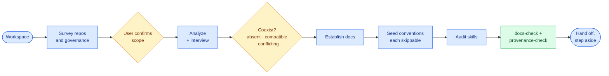

# Onboard (connector / bootstrap)

The one-shot starting point that applies eunomai to a new or existing project, then steps aside. It is the
**cold-start**; the pillars are the **steady-state**. `eunomai-onboard` establishes; living-docs,
skill-finder, the hooks, and OpenSpec maintain.

## Project root vs workspace

onboard does **not** assume "the project = the current directory". A workspace can have an **environment repo**
at the root (dotfiles, tooling config) with one or more **nested** project repos, and may be **multirepo**. The
eunomai layer anchors at each **project root**, never the workspace root by default — so onboard begins with a
read-only **workspace survey** and lets the user confirm scope (*detect, don't assume*) — see the flow below.

## What it does

Per confirmed project root (a multirepo runs each project independently):
0. **Survey.** The `workspace-survey` subagent maps repos (root and nested), remotes, manifests and existing
   governance (hooks, permissions, skills, registries), and proposes environment vs project. The user
   confirms scope and where the layer anchors.
1. **Analyze** the stack, docs and skills, and gather input through a structured interview.
2. **Coexist.** Classify each surface — `AGENTS.md`, docs standard, SDD, permissions, hooks, skills — as
   absent, compatible or conflicting. Conflicts go through the interview, with "adapt to what exists"
   recommended; declined seeds are skipped.
3. **Docs.** Apply the living-docs standard, restructuring existing docs or creating them. From-scratch
   interviews crystallize into ADRs and a glossary page. Community-health files are warnings unless the
   repository is public.
4. **Seed**, each skippable:
   - a lean `AGENTS.md` (merged into if one exists; an existing `CLAUDE.md` is offered a rename);
   - `openspec/config.yaml`, only where no SDD process exists;
   - the permissions baseline;
   - the guard's settings and attribution policy through `eunomai-safe-controls`. The hooks come from the
     installed plugin and are never copied.
5. **Skills.** Invoke `eunomai-skill-finder` in audit mode.
6. **Checks.** Drive `docs-check` and `provenance-check` to green, from the project root.
7. **Hand off** to the steady-state pillars, and step aside. An environment root gets at most a minimal
   delegating `AGENTS.md`, with consent.

## The structured interview

onboard gathers author input — and recovers knowledge when creating docs from scratch — through a **structured
interview**, not a form dump: **one question at a time**, **recommend a default** per question, and **explore
the codebase first** when a question is answerable from code (don't ask what you can detect). It stays
human-in-control and skippable. When creating docs from scratch, the answers crystallize into the living-docs
standard — non-trivial choices become **ADRs** (`docs/decisions/`) and the domain vocabulary becomes a
**glossary** explanation page. (`eunomai-living-docs` uses the same technique to recover thin or missing docs.)

## Principles it honours

- **Coexist, don't supplant** — additive, never replacing; on conflict the incumbent wins unless the author
  decides otherwise (the [coexistence contract](org-adoption.md)); OpenSpec is the default SDD engine only
  where none exists.
- **Establish, don't maintain** — ongoing work belongs to the per-pillar skills; onboard delegates.
- **One-shot, dispensable** — everything it seeds lives in the project's own files; remove eunomai and the
  project still works (zero lock-in).
- **Orchestrate, don't reimplement** — it reuses the pillars rather than duplicating them.
- **No conformance engine** — "onboarded" means the existing checks (`docs-check`, `provenance-check`) pass;
  there is no new check and no continuous cross-project audit (that was the abandoned governance tower).

## The seed

The conventions onboard drops in are **derived from eunomai's own live, dogfooded files** (its `AGENTS.md`,
`openspec/config.yaml`, `docs/safe-controls.md`) and adapted to the target — not copies that could drift.

## The activator block (the behavioural seed)

The seeded `AGENTS.md` has two halves: the **structural** half (boundary + paths) and the **behavioural**
half — a plain-language **activator block** that makes any agent follow the base. In KDD terms `AGENTS.md` is
the *semi-active* layer; the block **activates** the base by pointing at the skills. The canonical block
lives **inside the `eunomai-onboard` skill** (so it ships with the plugin and resolves wherever the skill
runs); onboard **adapts** it to the project — it does not paste it verbatim. When the project already has a
`AGENTS.md`, the block is **appended under its own heading** and the existing content is preserved.

Three invariants keep it honest:

- **Self-sufficient** — each line is actionable *prose* on its own; the parenthetical skill is an accelerator,
  not a prerequisite. So it still guides a collaborator who has only OpenSpec, or nothing (the audience
  gradient), and survives the skills being removed (dispensability).
- **Capabilities, not brand** — the block names *capabilities*, never the "eunomai" framework, so the project
  reads as its own and removing eunomai leaves it coherent.
- **Activate, don't duplicate** — it states the *principle*; the *procedure* stays in the skill. That keeps the
  block lean and avoids a second source of truth.

Seeded **once and disowned** — no back-sync, no new check.
