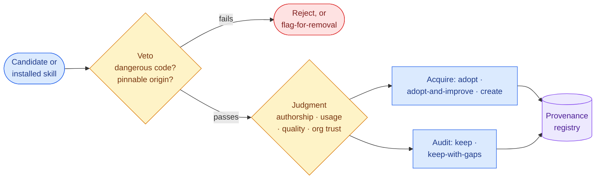

# Skill finder

The judgment layer for a project's skills. Anthropic's **skill-creator** authors/improves/evaluates skills
well, but does not do sourcing, trust, provenance, or security. `eunomai-skill-finder` fills that gap — and is
a **best-effort floor-raiser, not a security guarantee** (safe-controls hooks are the runtime backstop).

## What it does

Two modes, sharing one gate:

- **Acquire** — discover candidates → trust gate → adopt / adopt-and-improve / create (via skill-creator) → a
  fit pass that adapts the skill to the project. Third-party content is vendored only on the author's
  confirmation.
- **Audit** — on demand and scoped: evaluate an existing or named skill and write/refresh its provenance.
  Already-installed skills get audit verdicts — `keep` · `keep-with-gaps` · `flag-for-removal` (removal is
  the human's call).

## The trust gate

A hard veto, then weighed judgment (mirroring safe-controls: one hard bar, the rest judgment).



| Stage | What | Result |
|-------|------|--------|
| **Veto** (hard bar) | read `SKILL.md` + bundled scripts for dangerous behavior; require a pinnable origin (SHA / `claude plugin validate`) | fail → **reject** (or **flag-for-removal** when auditing an installed skill) |
| **Judgment** | authorship · usage · quality (quality measurable via skill-creator's eval/benchmark) · org trust declared in the project's rules, weighed as provenance context | `adopt` / `adopt-and-improve` / `create` — audit: `keep` / `keep-with-gaps` / `flag-for-removal` |

Reuse is total: skill-creator owns authoring; eunomai owns the gate, the provenance, and the playbook.
Org-trusted sources (declared in the project's rules — see [org-adoption](org-adoption.md)) are an input the
gate weighs and records; they never bypass the veto.

## Provenance (one audit registry, not sidecars)

Trust lives in **one** `eunomai-skills-audit.md` at the skills root — `.claude/skills/` in a consumer project,
`skills/` in the eunomai plugin. Skill folders stay clean (just the skill); the registry is the per-project,
generated audit (not a central allowlist):

```yaml
---
generated: <YYYY-MM-DD>
skills:
  - name: <skill dir name>
    origin: <url / marketplace id / "authored">
    ref: <real commit SHA / version | "authored" | "unpinned">
    verdict: adopt | adopt-and-improve | create | authored | keep | keep-with-gaps | flag-for-removal
    rubric: <one line>
    gaps: []          # e.g. [unpinned] — surfaced, never hidden
---
# eunomai skills audit
<run narrative: what was searched, verdicts, notes>
```

```bash
node tools/dist/cli.cjs provenance-check   # read-only
```

The check scans `.claude/skills/` **and** `skills/`, **fails** on any skill not covered by the registry (or an
invalid registry), and **lists trust gaps** (e.g. `unpinned`) to act on. It runs as part of the gate.
Org-trusted sources, if any, live in the project's **rules** — not here. Skills delivered by other installed
plugins are outside the registry's scope (trusted at the plugin/marketplace level); audit reports state that
boundary rather than implying coverage.
